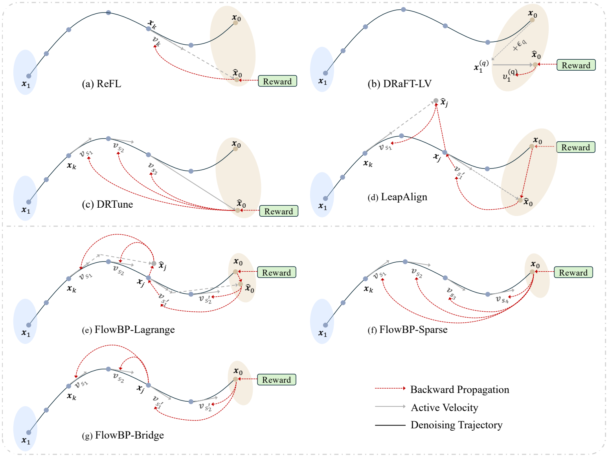

<h1 align="center">FlowBP</h1>

<p align="center">
  <b>Exploring the Design Space of Reward Backpropagation for Flow Matching</b>
</p>

<p align="center">
  <b>Official PyTorch Implementation</b>
</p>

<p align="center">
  Ruoyu Wang<sup>1,2,*</sup>,
  Boye Niu<sup>2,3,*</sup>,
  Xiangxin Zhou<sup>2,*,†,‡</sup>,
  Yushi Huang<sup>2,4</sup>,
  Tongliang Liu<sup>3</sup>,
  Chi Zhang<sup>1,‡</sup>
</p>

<p align="center">
  <sup>1</sup>Westlake University &nbsp;
  <sup>2</sup>Tencent Hunyuan &nbsp;
  <sup>3</sup>University of Sydney &nbsp;
  <sup>4</sup>The Hong Kong University of Science and Technology
</p>

<p align="center">
  <sup>*</sup>Equal contribution &nbsp;
  <sup>†</sup>Project lead &nbsp;
  <sup>‡</sup>Corresponding author
</p>

<p align="center">
  <a href="https://arxiv.org/abs/2606.11075">arXiv</a> |
  <a href="#method-overview">Method</a> |
  <a href="#main-results">Results</a> |
  <a href="#installation">Installation</a> |
  <a href="#quick-start">Quick Start</a> |
  <a href="#citation">Citation</a>
</p>

This repository contains the reference implementation for **FlowBP**, a
surrogate-trajectory framework for direct reward backpropagation on
text-to-image flow matching models.

FlowBP keeps the normal sampling rollout under `no_grad`, caches the sampled
trajectory, and then constructs a compact backward surrogate from cached and
selectively re-forwarded velocities. The reward model scores the actual sampled
image, while memory cost and gradient depth are controlled by the surrogate.



## Highlights

- **Unified design space.** FlowBP separates direct reward backpropagation into
  four choices: reward-model input, active timesteps, integration weights, and
  bridge coupling.
- **Three new variants.** `FlowBP-Sparse`, `FlowBP-Bridge`, and
  `FlowBP-Lagrange` instantiate different accuracy, memory, and coupling
  trade-offs.
- **Strong cross-backbone gains.** On `SD3.5-M`, `FLUX.1-dev`, and
  `FLUX.2-Klein-base`, FlowBP variants improve over the base model on all five
  HPDv2 metrics and lead most preference/quality scores.
- **Baseline coverage.** The code also includes direct-gradient baselines:
  `ReFL`, `DRaFT-LV`, `DRTune`, and `LeapAlign`.

## Table of Contents

- [Method Overview](#method-overview)
- [Main Results](#main-results)
- [Supported Backbones](#supported-backbones)
- [Installation](#installation)
- [Quick Start](#quick-start)
- [Evaluation](#evaluation)
- [Repository Layout](#repository-layout)
- [Citation](#citation)

## Method Overview

Directly differentiating a reward through a flow sampler is sample-efficient,
but naive full-trajectory backpropagation is impractical for modern text-to-image
models:

- storing activations for every denoising step is too expensive;
- chained Jacobian products across many steps can inflate gradients;
- connector shortcuts such as LeapAlign avoid full backpropagation, but a long
  single-velocity leap can create a large connector residual.

FlowBP treats the backward trajectory itself as the design object. A cached
forward rollout provides the sampled endpoint, and a smaller surrogate graph
decides where the reward gradient is allowed to flow.

| Design axis | What it controls |
| --- | --- |
| Reward-model input | Whether the reward sees the sampled image `x_0` or a posterior-mean estimate. |
| Active set | Which timesteps are re-forwarded with gradients. |
| Integration weights | Euler weights `h_i` or higher-order Lagrange quadrature weights. |
| Bridge coupling | Whether a split latent keeps one nested cross-step gradient path, scaled by `alpha`. |

This view recovers prior direct-gradient methods as specific surrogate choices:
ReFL, DRaFT-LV, and DRTune use short or sparse detached reward targets;
LeapAlign uses a two-hop connector path; FlowBP explores endpoint-faithful sparse
reconstruction, controlled bridge coupling, and higher-order leap quadrature.

### FlowBP Variants

| Method              | Reward input        | Weights             | Active set               | Bridge          |
| ---------------------| ---------------------| ---------------------| --------------------------| -----------------|
| ReFL                | Posterior mean      | Single-step         | `{tau}`                  | No              |
| DRaFT-LV            | Sampled image `x_0` | Last-step           | `{1}`                    | No              |
| DRTune              | Posterior mean      | Euler + leap        | Sparse train steps       | No              |
| LeapAlign           | Sampled image `x_0` | Two Euler leaps     | `{k, j}`                 | Yes             |
| **FlowBP-Sparse**   | Sampled image `x_0` | Euler               | `K` indices              | No              |
| **FlowBP-Bridge**   | Sampled image `x_0` | Euler               | `K` indices split at `j` | Tunable `alpha` |
| **FlowBP-Lagrange** | Sampled image `x_0` | Lagrange quadrature | Compact support set      | Tunable `alpha` |

## Main Results

All results below are evaluated on the **HPDv2 test split** with 400 held-out
prompts. Post-training uses HPSv2.1 as the differentiable reward, so HPSv2.1 is
the in-domain metric; PickScore, ImageReward, UR-Align, and UR-IQ are
out-of-domain evaluators. Higher is better for every metric.

### SD3.5-M

| Method | HPSv2.1 | PickScore | ImageReward | UR-Align | UR-IQ |
| --- | ---: | ---: | ---: | ---: | ---: |
| SD3.5-M | 0.2881 | 22.5004 | 0.9504 | 3.3935 | 3.6376 |
| ReFL | 0.3872 | 23.4021 | 1.3799 | 3.4779 | 3.9464 |
| DRaFT-LV | 0.3818 | 23.3506 | 1.3673 | 3.5072 | 3.9245 |
| DRTune | 0.3870 | 23.2882 | 1.3794 | 3.4562 | 3.8869 |
| LeapAlign | 0.3924 | 23.3142 | 1.4425 | 3.4854 | 3.9030 |
| **FlowBP-Sparse** | 0.3939 | 23.4104 | 1.4299 | 3.4774 | **3.9690** |
| **FlowBP-Bridge** | 0.3966 | 23.4130 | 1.4386 | 3.4712 | 3.9481 |
| **FlowBP-Lagrange** | **0.3998** | **23.5040** | **1.4538** | **3.5127** | 3.9680 |

On `SD3.5-M`, FlowBP-Lagrange leads HPSv2.1, PickScore, ImageReward, and
UR-Align, while FlowBP-Sparse gives the best UR-IQ.

### FLUX.1-dev 12B

| Method | HPSv2.1 | PickScore | ImageReward | UR-Align | UR-IQ |
| --- | ---: | ---: | ---: | ---: | ---: |
| FLUX.1-dev | 0.3016 | 22.5940 | 1.0094 | 3.3168 | 3.7551 |
| ReFL | 0.3930 | 23.6886 | 1.3916 | 3.5005 | 4.0293 |
| DRaFT-LV | 0.3900 | 23.6290 | 1.3910 | 3.5264 | 4.0259 |
| DRTune | 0.3920 | 23.6704 | 1.4273 | 3.5403 | 4.0697 |
| LeapAlign | 0.4063 | 23.6158 | 1.4373 | 3.5290 | 4.0584 |
| **FlowBP-Sparse** | 0.4081 | 23.7458 | 1.4742 | 3.5408 | 4.0897 |
| **FlowBP-Bridge** | 0.4119 | **23.7952** | **1.5156** | 3.5681 | **4.1098** |
| **FlowBP-Lagrange** | **0.4134** | 23.7796 | 1.4906 | **3.5848** | 4.0950 |

On `FLUX.1-dev`, FlowBP-Lagrange is strongest on HPSv2.1 and UR-Align, while
FlowBP-Bridge leads PickScore, ImageReward, and UR-IQ.

### FLUX.2-Klein-base 9B

| Method | HPSv2.1 | PickScore | ImageReward | UR-Align | UR-IQ |
| --- | ---: | ---: | ---: | ---: | ---: |
| FLUX.2-Klein-base | 0.2873 | 22.3158 | 1.1405 | 3.6392 | 3.7982 |
| ReFL | 0.4272 | 23.6002 | 1.6245 | 3.6817 | 4.0565 |
| DRaFT-LV | 0.4233 | 23.6288 | 1.6262 | 3.6495 | 3.9319 |
| DRTune | 0.4122 | 23.5716 | 1.6264 | 3.6638 | 4.0589 |
| LeapAlign | 0.4246 | 23.4884 | 1.6553 | **3.6926** | 4.0625 |
| **FlowBP-Sparse** | 0.4384 | **23.8446** | **1.6649** | 3.6720 | **4.0787** |
| **FlowBP-Bridge** | **0.4387** | 23.7718 | 1.6491 | 3.6775 | 4.0720 |
| **FlowBP-Lagrange** | 0.4321 | 23.6938 | 1.6376 | 3.6705 | 4.0652 |

On `FLUX.2-Klein-base`, reconstruction-based FlowBP variants dominate most
metrics: FlowBP-Bridge gives the best HPSv2.1, and FlowBP-Sparse gives the best
PickScore, ImageReward, and UR-IQ. LeapAlign remains strongest on UR-Align.

### GenEval on FLUX.1-dev

GenEval measures compositional prompt following. Values below are task-level
accuracies or the official overall score.

| Method | Overall | Single Obj. | Two Obj. | Count | Color | Position | Attr. Binding |
| --- | ---: | ---: | ---: | ---: | ---: | ---: | ---: |
| FLUX.1-dev | 63.25 | 97.81 | 76.52 | 70.31 | 76.86 | 17.75 | 40.25 |
| ReFL | 65.94 | 97.50 | 77.27 | 71.88 | 78.99 | 22.25 | 47.75 |
| DRaFT-LV | 68.31 | 98.13 | **86.36** | **75.00** | 77.13 | 23.25 | 50.00 |
| DRTune | 66.78 | 98.75 | 80.56 | 72.81 | 76.33 | 20.75 | 51.50 |
| LeapAlign | 67.44 | 98.44 | 84.09 | 72.19 | 78.19 | 22.25 | 49.50 |
| **FlowBP-Sparse** | 68.19 | 98.75 | 84.85 | 73.13 | 78.19 | 22.00 | 52.25 |
| **FlowBP-Bridge** | 68.75 | 96.88 | 85.10 | 70.94 | 76.86 | **27.25** | 55.50 |
| **FlowBP-Lagrange** | **69.88** | **99.06** | 85.10 | 71.88 | **79.52** | 23.75 | **60.00** |

FlowBP-Lagrange improves the GenEval overall score from **63.25** to **69.88**
and gives the best single-object, color, and attribute-binding scores.
FlowBP-Bridge gives the best spatial-position score.

## Ablation Takeaways

- **Endpoint-faithful reward input matters.** Replacing posterior-mean reward
  targets with endpoint reconstruction improves ReFL/DRTune-style surrogates on
  `FLUX.1-dev`.
- **Higher-order connectors reduce mismatch.** FlowBP-Lagrange lowers connector
  deviation over long leaps compared with single-velocity Euler connectors,
  which helps avoid reward collapse when the surrogate endpoint drifts.
- **Bridge coupling should be controlled.** FlowBP-Bridge benefits from an
  intermediate nested-gradient scale: enough coupling to propagate signal across
  the split, but not so much that the single-Jacobian path dominates.
- **Active-step budgets are compact.** Increasing `K` improves trajectory
  coverage but also grows the backward graph; the final configs use small active
  sets to keep memory bounded.

## Supported Backbones

The implementation is organized by model family:

```text
flowbp/trainers/
  common/      # shared sampling and high-order quadrature utilities
  flux1/       # FLUX.1-dev trainers
  flux2/       # FLUX.2-Klein-base trainers
  sd35/        # SD3.5-M trainers
```

Training entrypoints:

```text
flowbp/train_flowbp_flux.py     # FLUX.1
flowbp/train_flowbp_flux2.py    # FLUX.2
flowbp/train_flowbp_sd35.py     # SD3.5
```

Final paper-style configs are under:

```text
configs/final/flux1/
configs/final/flux2/
configs/final/sd35/
```

Each family provides configs for FlowBP-Sparse, FlowBP-Bridge,
FlowBP-Lagrange, and the baseline methods.

## Installation

Reference environment used for the paper experiments:

| Component | Version                              |
| -----------| --------------------------------------|
| Python    | 3.10                                 |
| CUDA      | 12.4                                 |
| PyTorch   | 2.6.0                                |
| GPU       | NVIDIA H20 / H100 / H800 / A100-80GB |


Clone the repository and run the setup script:

```bash
git clone https://github.com/RuoyuWang-2077/FlowBP
cd FlowBP
bash setup.sh
```

The script creates a `flowbp` conda environment with Python 3.10, installs the
PyTorch stack before source-built extensions such as `flash-attn`, installs the
pinned paper environment from `requirements.txt`, and installs this repository
in editable mode without re-resolving dependencies from `pyproject.toml`.

Equivalent manual setup:

```bash
git clone https://github.com/RuoyuWang-2077/FlowBP
cd FlowBP

conda create -n flowbp python=3.10 -y
conda activate flowbp

python -m pip install --upgrade pip setuptools wheel packaging ninja
python -m pip install torch==2.6.0 torchvision==0.21.0 torchaudio==2.6.0
python -m pip install flash_attn==2.7.4.post1 --no-build-isolation
pip install -r requirements.txt
pip install -e . --no-deps
```

Model checkpoints, reward checkpoints, and precomputed prompt embeddings are not
committed to this repository. Update the paths in `configs/final/**` or override
them from the command line.

## Quick Start

### 1. Preprocess prompts

The training code expects precomputed prompt embeddings:

```bash
bash scripts/preprocess/preprocess_flux1_embeddings.sh
bash scripts/preprocess/preprocess_flux2_embeddings.sh
bash scripts/preprocess/preprocess_sd35_embeddings.sh
```

Common overrides:

```bash
MODEL_PATH=/path/to/model \
PROMPT_FILE=assets/prompts.txt \
OUTPUT_DIR=data/rl_embeddings_flux2 \
bash scripts/preprocess/preprocess_flux2_embeddings.sh
```

### 2. Train a FlowBP model

Use the family-specific launch scripts:

```bash
bash scripts/finetune/train_flux1.sh
bash scripts/finetune/train_flux2.sh
bash scripts/finetune/train_sd35.sh
```

Each script defaults to the FlowBP-Lagrange final config for that backbone.
Override `CONFIG` to run another method:

```bash
CONFIG=configs/final/flux1/flux1_flowbp_sparse.yaml \
bash scripts/finetune/train_flux1.sh

CONFIG=configs/final/flux2/flux2_klein_base_9b_flowbp_bridge.yaml \
bash scripts/finetune/train_flux2.sh

CONFIG=configs/final/sd35/sd3_5_leapalign.yaml \
bash scripts/finetune/train_sd35.sh
```


### 3. Choose a final config

| Backbone | FlowBP-Sparse | FlowBP-Bridge | FlowBP-Lagrange |
| --- | --- | --- | --- |
| FLUX.1-dev | `configs/final/flux1/flux1_flowbp_sparse.yaml` | `configs/final/flux1/flux1_flowbp_bridge.yaml` | `configs/final/flux1/flux1_flowbp_lagrange.yaml` |
| FLUX.2-Klein-base | `configs/final/flux2/flux2_klein_base_9b_flowbp_sparse.yaml` | `configs/final/flux2/flux2_klein_base_9b_flowbp_bridge.yaml` | `configs/final/flux2/flux2_klein_base_9b_flowbp_lagrange.yaml` |
| SD3.5-M | `configs/final/sd35/sd3_5_flowbp_sparse.yaml` | `configs/final/sd35/sd3_5_flowbp_bridge.yaml` | `configs/final/sd35/sd3_5_flowbp_lagrange.yaml` |

Baseline configs are available in the same directories for `refl`, `draft_lv`,
`drtune`, and `leapalign`.

## Evaluation

Online evaluation lives under `flowbp/eval/`. The main scoring interface is
`MultiScorer`, with reward backends for:

- HPSv2
- CLIPScore
- PickScore
- ImageReward
- GenEval scoring
- UnifiedReward-style scoring

Reward checkpoint lookup is configured through `reward_ckpt_path` in the YAML
configs or the `FLOWBP_REWARD_CKPT_PATH` environment variable.

Recommended local layout:

```text
models/reward_ckpts/
  open_clip_pytorch_model.bin          # HPSv2 OpenCLIP backbone
  HPS_v2.1_compressed.pt               # HPSv2.1 reward checkpoint
  HPSv3/
    HPSv3_7B.yaml                      # optional HPSv3 inferencer config
    HPSv3.safetensors                  # or HPS_v3.1_compressed.pt / HPSv3.pt
  ImageReward/                         # ImageReward cache/checkpoints
  mask2former_swin-s-p4-w7-224_*.pth  # optional GenEval detector checkpoint
```

The canonical final configs listed above use the portable default:

```yaml
eval:
  reward_ckpt_path: models/reward_ckpts
```

You can override it without editing YAML:

```bash
export FLOWBP_REWARD_CKPT_PATH=/path/to/reward_ckpts
```

HPSv3 can also be pointed at explicit files:

```bash
export FLOWBP_HPSV3_CONFIG_PATH=/path/to/HPSv3_7B.yaml
export FLOWBP_HPSV3_CHECKPOINT_PATH=/path/to/HPSv3.safetensors
```

Unavailable optional scorers can be skipped by the evaluation runner. For
offline clusters, make sure reward-model checkpoints and any detector/backbone
weights are pre-downloaded and that config paths point to local directories.

## Repository Layout

```text
configs/final/                  # final paper-style configs
flowbp/config/flowbp.py         # YAML config loader and trainer-name aliases
flowbp/train_flowbp_*.py        # training entrypoints
flowbp/trainers/                # trainer implementations by backbone
flowbp/data_preprocess/         # prompt embedding preprocessors
flowbp/dataset/                 # dataset loaders for precomputed embeddings
flowbp/eval/                    # generation and reward evaluation
scripts/finetune/               # training launch scripts
scripts/preprocess/             # preprocessing launch scripts
assets/readme/                  # README figures
```

## Acknowledgements

FlowBP builds on the broader line of direct reward-backpropagation methods for
flow-matching alignment. We thank the [LeapAlign project](https://github.com/RockeyCoss/LeapAlign_Code)
for its open-source implementation and for helping establish this research
direction.

## Citation

If you use this code, please cite:

```bibtex
@misc{wang2026exploringdesignspacereward,
  title = {Exploring the Design Space of Reward Backpropagation for Flow Matching},
  author = {Ruoyu Wang and Boye Niu and Xiangxin Zhou and Yushi Huang and Tongliang Liu and Chi Zhang},
  year = {2026},
  eprint = {2606.11075},
  archivePrefix = {arXiv},
  primaryClass = {cs.LG},
  url = {https://arxiv.org/abs/2606.11075}
}
```

## License

This repository is released under the Apache-2.0 license. See `LICENSE` for
details.
